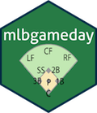

<!-- README.md is generated from README.Rmd. Please edit that file -->
mlbgameday 
=====================================================================

[](https://travis-ci.org/keberwein/mlbgameday) [](http://www.r-pkg.org/badges/version/mlbgameday) [](http://www.repostatus.org/#active)

Why mlbgameday?
---------------

Designed to facilitate extract, transform and load for MLBAM “Gameday” data. The package is optimized for parallel processing of data that may be larger than memory. There are other packages in the R universe that were built to perform statistics and visualizations on these data, but `mlbgameday` is concerned primarily with data collection. More uses of these data can be found in the `pitchRx`, `openWAR`, and `baseballr` packages.

Install
-------

-   Stable version from CRAN

``` r
install.packages("mlbgameday")
```

-   The latest development version from GitHub:

``` r
devtools::install_github("keberwein/mlbgameday")
```

Basic Usage
-----------

Although the package is optimized for parallel processing, it will also work without registering a parallel backend. When only querying a single day's data, a parallel backend may not provide much additional performance. However, parallel backends are suggested for larger data sets, as the process will be faster by several orders of magnitude.

``` r
library(mlbgameday)

innings_df <- get_payload(start = "2017-04-03", end = "2017-04-04")
```

Take a peek at the data.

``` r
head(innings_df$atbat, 1)
#>   num b s o start_tfs       start_tfs_zulu batter stand b_height pitcher
#> 1   1 2 2 1    170552 2017-04-03T17:05:52Z 543829     L     5-11  544931
#>   p_throws                                                  des
#> 1        R Dee Gordon lines out to left fielder Jayson Werth.  
#>                                                                des_es
#> 1 Dee Gordon batea línea de out a jardinero izquierdo Jayson Werth.  
#>   event_num   event     event_es home_team_runs away_team_runs inning
#> 1        11 Lineout Línea de Out              0              0      1
#>   next_ inning_side
#> 1     Y         top
#>                                                                                                                      url
#> 1 http://gd2.mlb.com/components/game/mlb//year_2017/month_04/day_03/gid_2017_04_03_miamlb_wasmlb_1/inning/inning_all.xml
#>         date                    gameday_link score
#> 1 2017-04-03 /gid_2017_04_03_miamlb_wasmlb_1  <NA>
#>                              play_guid event2 event2_es event3 event3_es
#> 1 76e23666-26f1-4339-967f-c6f759d864f4   <NA>      <NA>   <NA>      <NA>
#>      batter_name      pitcher_name
#> 1 Devaris Gordon Stephen Strasburg
```

Parallel Processing
-------------------

The package's internal functions are optimized to work with the `doParallel` package. By default, the R language will use one core of our CPU. The `doParallel` package enables us to use several cores, which will execute tasks simultaneously. In a standard regular season for all teams, the function has to process more than 2,400 individual files, which depending on your system, can take quite some time. Parallel processing speeds this process up by several times, depending on how many processor cores we choose to use.

``` r
library(mlbgameday)
library(doParallel)

# First we need to register our parallel cluster.
# Set the number of cores to use as the machine's maximum number of cores minus 1 for background processes.
no_cores <- detectCores() - 1
cl <- makeCluster(no_cores)  
registerDoParallel(cl)

# Then run the get_payload function as normal.
innings_df <- get_payload(start = "2017-04-03", end = "2017-04-10")

# Don't forget to stop the cluster when finished.
stopImplicitCluster()
rm(cl)
```

Note: The `mlbgameday` package is inteded for use on a single machine, using multiple cores. However, it may be possible to use a cluster of multiple machines as well. For more on parallel processing, please see the [package vignettes](https://github.com/keberwein/mlbgameday/tree/master/vignettes)

Databases
---------

When collecting several seasons worth of data, the data may become larger than memory. If this is the case, the `mlbgameday` package includes functionality to break the data into "chunks" and load into a database. Database connections are provided by the `DBI` package, which includes connections for most modern relational databases. Below is an example that creates a SQLite database in our working directory and populates it with MLBAM Gameday data. Although this technique is fast, it is also a system intensive process. The authors of `mlbgameday` suggest loading no more than a single season per R session.

``` r
library(mlbgameday)
library(doParallel)
library(DBI)
library(RSQLite)

# First we need to register our parallel cluster.
no_cores <- detectCores() - 1
cl <- makeCluster(no_cores)  
registerDoParallel(cl)

# Create the database in our working directory.
con <- dbConnect(RSQLite::SQLite(), dbname = "gameday.sqlite3")

# Collect all games, including pre and post-season for the 2016 season.
innings_df <- get_payload(start = "2016-01-01", end = "2017-01-01", db_con = con)

# Don't forget to stop the cluster when finished.
stopImplicitCluster()
rm(cl)
```

For a more in-depth look at reading and writing to databases, please see the [package vignettes.](https://github.com/keberwein/mlbgameday/tree/master/vignettes)

Gameday Data Sets
-----------------

Those familiar with Carson Sievert's `pitchRx` package probably recognize the default data format returned by the `get_payload()` function. The format was intentionally designed to be similar to the data returned by the `pitchRx` package for those who may be keeping persistent databases. The default data set returned is "inning\_all," however there are several more options including:

-   inning\_hit

-   bis\_boxscore

-   game\_events

-   linescore

For example, the following with query the linescore data set.

``` r
library(mlbgameday)

linescore_df <- get_payload(start = "2017-04-03", end = "2017-04-04", dataset = "linescore")
```

Visualization
-------------

The `mlbgameday` package is data-centric and does not provide any built-in visualization tools. However, there are several excellent visualization packages available for the R language. Below is a short example of what can be done with `ggplot2`. For more examples, please see the [package vignettes](https://github.com/keberwein/mlbgameday/tree/master/vignettes).

First, get the data.

``` r
library(mlbgameday)
library(dplyr)

# Grap some Gameday data. We're specifically looking for Jake Arrieta's no-hitter.
gamedat <- get_payload(start = "2016-04-21", end = "2016-04-21")

# Subset that atbat table to only Arrieta's pitches and join it with the pitch table.
pitches <- inner_join(gamedat$pitch, gamedat$atbat, by = c("num", "url")) %>%
    subset(pitcher_name == "Jake Arrieta")
```

``` r
library(ggplot2)

# basic example
ggplot() +
    geom_point(data=pitches, aes(x=px, y=pz, shape=type, col=pitch_type)) +
    coord_equal() + geom_path(aes(x, y), data = mlbgameday::kzone)
```


``` r
library(ggplot2)

# basic example with stand.
ggplot() +
    geom_point(data=pitches, aes(x=px, y=pz, shape=type, col=pitch_type)) +
    facet_grid(. ~ stand) + coord_equal() +
    geom_path(aes(x, y), data = mlbgameday::kzone)
```


Acknowledgements
----------------

This package was inspired by the [mlbgame](https://github.com/panzarino/mlbgame) Python library by Zach Panzarino, the [pitchRx](https://github.com/cpsievert/pitchRx) package by Carson Sievert and the [openWAR](https://github.com/beanumber/openWAR) package by Ben Baumer and Gregory Matthews.
